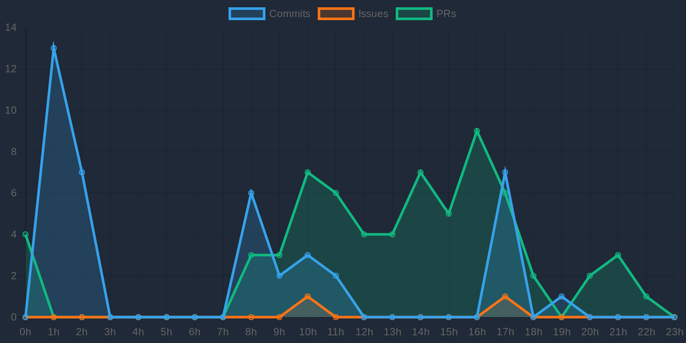

# Bruno Magalhães – Engenheiro de Software & Especialista em DevSecOps

Olá, eu sou o **Bruno Magalhães**.  
Desenvolvedor **full-stack** com mais de 10 anos de experiência em aplicações corporativas, com forte atuação em análise de sistemas, desenvolvimento, integração de APIs, Docker e práticas DevSecOps. Busco sempre otimizar processos e entregar soluções seguras e escaláveis.

---

## 🚀 Tecnologias & Competências

  
<strong>Linguagens & Frameworks</strong>

   

  

    
    
    
    
    
  

  
<strong>Integração & Bancos de Dados</strong>

   

  

    
    
    
    
    
    
  

  
<strong>Ferramentas de Desenvolvimento</strong>

   

  

    
    
    
  

  
<strong>DevSecOps & Segurança</strong>

   

  

    
    
    
    
    
    
  

---

## 📊 Dashboards e Métricas

  
<strong>Ver Gráficos do GitHub</strong>

   

  

  ### Atividade no GitHub

  
  
  
  
  
  
  

### Horários de Commit

### Horários de Commit

### Métricas WakaTime

  

  
<strong>Meu Dashboard Global</strong>

   

  Este repositório gera um gráfico (`gh-stats.png`) que soma todos os Commits, Issues e PRs  
  de todos os repositórios onde sou owner/colaborador (últimos 30 dias).

  

---

## 💼 Experiência Profissional

  
<strong>Arquiteto de Software – LAMPP-IT SOLUTIONS</strong>

   

  **São Luís, MA**  
  **Fev 2022 – Fev 2024**  
  - Definição da arquitetura de soluções e requisitos técnicos para projetos governamentais.  
  - Coordenação de equipes utilizando metodologias ágeis (Scrum e Kanban).  
  - Uso de ferramentas como Power Designer e Trello para modelagem e gestão de projetos.

  
<strong>Supervisor de Banco de Dados – SQL Server – Secretaria Municipal de Saúde</strong>

   

  **São Luís, MA**  
  **Fev 2022 – Fev 2024**  
  - Gestão e liderança da equipe de DBAs, assegurando integridade e alta disponibilidade dos dados.  
  - Otimização de operações e implementação de estratégias robustas de backup e recuperação.

  
<strong>Supervisor de Desenvolvimento de Sistemas – Secretaria de Estado da Educação do Maranhão</strong>

   

  **São Luís, MA**  
  **Nov 2019 – Fev 2022**  
  - Liderança de equipes de desenvolvimento em projetos educacionais.  
  - Desenvolvimento full-stack com .NET, integração de serviços SOAP/REST e análise de sistemas.

  
<strong>Analista de Sistemas Sênior – Secretaria de Estado da Educação do Maranhão</strong>

   

  **São Luís, MA**  
  **Mar 2011 – Dez 2019**  
  - Criação e evolução de sistemas corporativos com VB.NET, Crystal Reports e SQL Server.  
  - Suporte técnico e documentação de soluções para ambientes educacionais.

  
<strong>Técnico de Infraestrutura – VECTRA Consultoria e Serviços</strong>

   

  **São Luís, MA**  
  **Out 2009 – Mar 2011**  
  - Administração de redes LAN/WAN e configuração de roteadores CISCO e Huawei.  
  - Monitoramento e gerenciamento de desempenho de rede, garantindo níveis de SLA.

---

## 🎓 Formação Acadêmica

  
<strong>Especialização em Ciência de Dados: Big Data e Analytics</strong>

   
  **UNYLEYA EDITORA E CURSOS S/A – Brasília, DF (2021 – 2022)**

  
<strong>Especialização em Lato Sensu em Análise e Projeto de Sistemas</strong>

   
  **Universidade Federal do Maranhão (UFMA) – São Luís, MA (2014 – 2016)**

  
<strong>Especialização em Planejamento e Implementação de Redes LAN e WAN</strong>

   
  **Universidade Estadual do Maranhão (UEMA) – São Luís, MA (2013 – 2014)**

  
<strong>Bacharelado em Sistemas de Informação</strong>

   
  **Centro Universitário do Maranhão (UniCeuma) – São Luís, MA (2005 – 2011)**

---

## 🏆 Conquistas e Certificações

  
<strong>Certificações DevSecOps & Docker</strong>

   

  Certificações específicas em Docker, containerização e práticas de segurança (DevSecOps) – *(Adicione os links ou selos das certificações, se houver)*

  

---

## 🔥 Projetos Recentes

  
<strong>Sistema de Gestão de Frota</strong>

   

  **[Repositório](https://github.com/borgesMagalhaes/frota)**  
  Plataforma completa para gerenciamento de veículos com integração de APIs e monitoramento em tempo real.

  
<strong>Autenticação com Active Directory</strong>

   

  **[Repositório](https://github.com/borgesMagalhaes/auth-AD)**  
  Solução robusta em VB.NET para autenticação corporativa via Active Directory.

  
<strong>Portal de Cadastro de Eventos</strong>

   

  **[Repositório](https://github.com/borgesMagalhaes/event-registration)**  
  Plataforma web para gestão de eventos com autenticação via OAuth e integração com serviços externos.

---

## 🌐 Redes Sociais

  
  
  
  
  

---

> “Talk is cheap. Show me the code.”  
> — Linus Torvalds
